# NLP-Model
Learn and demonstrate some  classical model


## 目录

* [Text-CNN](#text-cnn)
* [LSTM&GRU](#lstm)
* [HAN](#HAN)
* [Glove](#glove)


## <span id="text-cnn">Text-CNN</span>
### 1. 模型展示
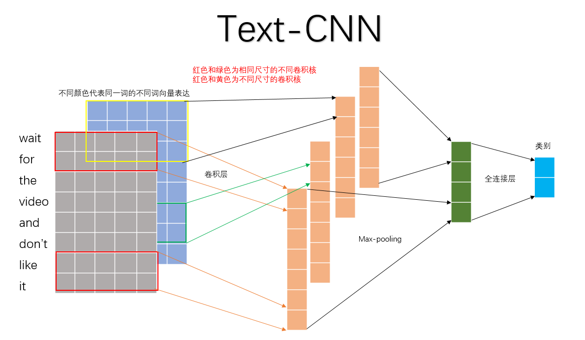

### 2. 参数与超参数

**sequence_length**  
Q: 对于CNN, 输入与输出都是固定的，可每个句子长短不一, 怎么处理?  
A: 需要做定长处理, 比如定为n, 超过的截断, 不足的补0. 注意补充的0对后面的结果没有影响，因为后面的max-pooling只会输出最大值，补零的项会被过滤掉.  

**num_classes**  
多分类, 分为几类.  

**vocabulary_size**  
语料库的词典大小, 记为|D|.


**embedding_size**  
将词向量的维度, 由原始的 |D| 降维到 embedding_size.


**filter_size_arr**  
多个不同size的filter.


### 3. demo流程
```C
str_length = 36  
word_vec = 128  
filter_size = [2,3,4] 每种尺寸2个filter  
```

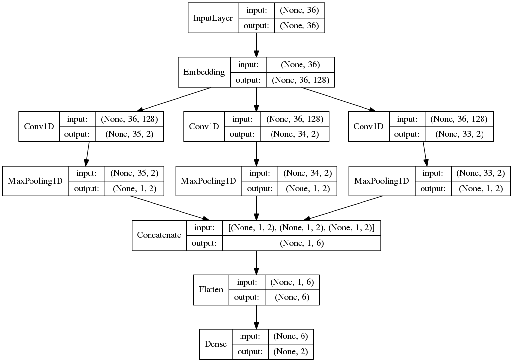

### 3.实验部分
#### 1 数据集介绍
1.1 实验的过程中只使用了[MR数据集](https://www.cs.cornell.edu/people/pabo/movie-review-data/)，验证方式是10 folds的交叉验证方式。
> 数据集中包含了5331 positive and 5331 negative processed sentences / snippets. Introduced in Pang/Lee ACL 2005. Released July 2005.

2.1 词向量包含以下三种(**可以任意选一种或多种累加当作一个词不同的channel**):
+ **CNN-rand**:句子中的的word vector都是随机初始化的，同时当做CNN训练过程中需要优化的参数；
+ **CNN-static**:句子中的word vector是使用word2vec预先对Google News dataset(about 100 billion words)进行训练好的词向量表中的词向量。且在CNN训练过程中作为固定的输入，不作为优化的参数；
+ **CNN-non-static**:句子中的word vector是使用word2vec预先对Google News dataset(about 100 billion words)进行训练好的词向量表中的词向量。在CNN训练过程中作为固定的输入，做为CNN训练过程中**需要优化**的参数；

说明：

> + GoogleNews-vectors-negative300.bin.gz词向量表是通过word2vec使用命令预先训练好，花费时间较长。
已经训练好的：[GoogleNews-vectors-negative300.bin.gz百度云盘下载地址](https://pan.baidu.com/share/init?surl=OglaQBBO30d5KdzZNNdRSg) 密码:18yf
> + word2vec预先训练命令如：```./word2vec -train text8(语料) -output vectors.bin(输出词向量表) -cbow(训练使用模型方式) 0 -size 48 -window 5 -negative 0 -hs 1 -sample 1e-4 -threads 20 -binary 1 -iter 100```
> + 除了使用word2vec对语料库进行预先训练外，也可以使用glove或FastText进行词向量训练。


#### 2.文件介绍

2.1 **process\_data.py**：加载Google训练的词向量表GoogleNews-vectors-negative300.bin，并对文本数据做一些预处理，使其转化为NN易用的形式，并将其存储在文件中。  
最终存储为一个word\_vec.p,其文件存储的内容是[**随机词向量表，已训练好的词向量表， 词频字典， 最大句子长度， revs**];  
其中revs是一个结构体列表,列表中的每个元素如下所示：
```
{
"y":0/1          #标签
"num_words":int  #句子长度
"text":str       #句子
"split":[0,10]   #十折交叉使用
}
```
2.2 **text_cnn_main.py**: 主程序文件。读取以上word_vec.p文件内容，设置一些配置信息并设置一些网络运行时需要的参数。  
2.3 **text_cnn_model.py**：text-cnn模型文件。


#### 3.实验结果展示
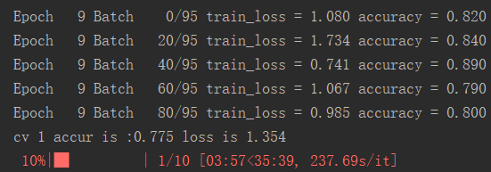


### 4.经验分享

在工作用到TextCNN做query推荐，并结合先关的文献，谈几点经验：  
1、TextCNN是一个n-gram特征提取器，对于训练集中没有的n-gram不能很好的提取。对于有些n-gram，可能过于强烈，反而会干扰模型，造成误分类。   
2、TextCNN对词语的**顺序不敏感**，在query推荐中，我把正样本分词后得到的term做随机排序，正确率并没有降低太多，当然，其中一方面的原因短query本身对term的顺序要求不敏感。          
3、TextCNN擅长长本文分类，在这一方面可以做到很高正确率。    
4、TextCNN在模型结构方面有很多参数可调，具体参看文末的文献。  

参考文献  
《Convolutional Neural Networks for Sentence Classification》   
《A Sensitivity Analysis of (and Practitioners’ Guide to) Convolutional Neural Networks for Sentence Classification》

---
> [参考博客](https://jianwenjun.xyz/2018/03/16/%E5%8D%B7%E7%A7%AF%E7%A5%9E%E7%BB%8F%E7%BD%91%E7%BB%9C-TextCNN-%E5%9C%A8%E5%8F%A5%E5%AD%90%E5%88%86%E7%B1%BB%E4%B8%8A%E7%9A%84%E5%AE%9E%E7%8E%B0/)   
> [参考博客](https://blog.csdn.net/u012762419/article/details/79561441)   
特此感谢

---

## <span id="lstm">LSTM&GRU</span>
利用LSTM做文本分类

### 1.Usage

#### 1.1 数据预处理
在data文件中，先使用`data_clean.py`对文本数据进行预处理

最后处理的格式信息如下：
```
df, word_vecs, word_cab_num, sentence_max_len, class_num
```
`df`:句子字典列表。其中包括句子的text、分类、split等辅助信息
```
{
"label":         #标签
"num_words":int  #句子长度
"text":str       #句子
"split":[0,10]   #十折交叉使用
}
```
`word_vecs`:文本中所有词的词向量表示  
`word_cab_num`:文本中共有多少不同的词汇  
`sentence_max_len`:句子的最大长度  
`class_num`:多分类问题分几类  


#### 1.2 模型超参
模型参数在`rnn_model.py`进行相关的设置。其中需要修改的包括：
```python
class TRNNConfig(object):
    self.embedding_dim = 100     # 词向量维度
    self.num_layers= 2           # 隐藏层层数
    self.hidden_dim = 128        # 隐藏层神经元
    self.rnn = 'lstm'             # lstm 或 gru

    self.dropout_keep_prob = 0.8 # dropout保留比例
    self.learning_rate = 1e-3    # 学习率

    self.batch_size = 128          # 每批训练大小
    self.num_epochs = 10           # 总迭代轮次
```
启动参数包括`rnn_run.py`的一些路径等配置信息
```
train_data = "../data/word_vec.p"  #配置数据清洗后生成的数据路径
label = "brand"                    #1中所述df的类别标签名
```

#### 1.3 运行
```python
rnn_run.py train #训练&验证
rnn_run.py test  #测试
```

### 2.模型介绍
#### 2.1 LSTM
lstm作为加入了attention机制的rnn网络，对长文本具有很好的记忆效果，其主要归功于模型结构。    
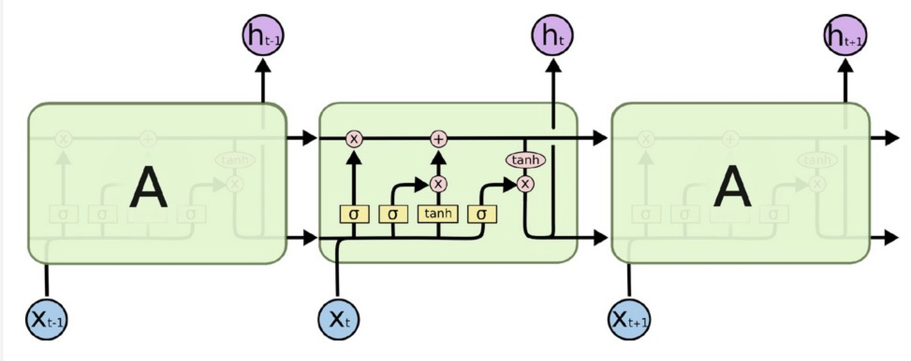

以下是一个lstm单元的结构（**一个lstm单元也就是网络中的一层,即由上述num_layers控制**）  
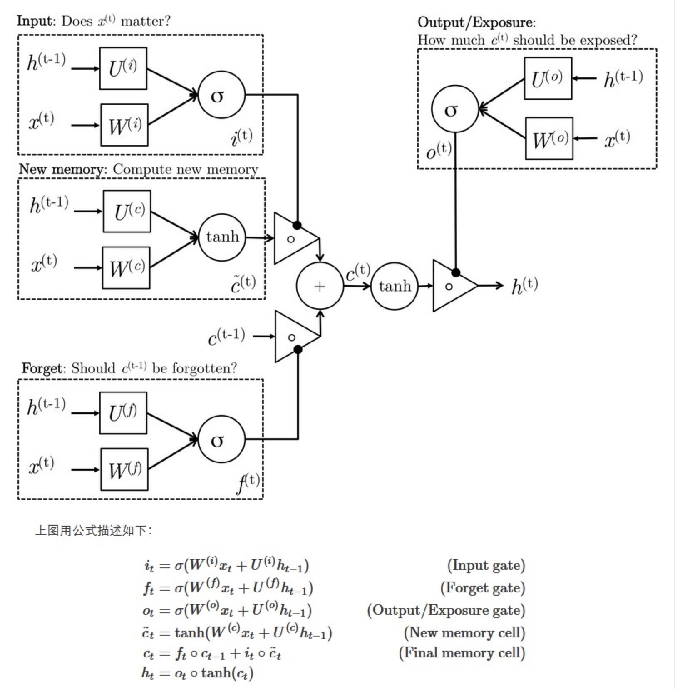
其中输出即是一个`hidden_dim`的向量，以上两个参数控制lstm最核心的网络架构。  

#### 2.2 GRU
gru可以说是lstm的初代版本，一个GRU单元如下所示  
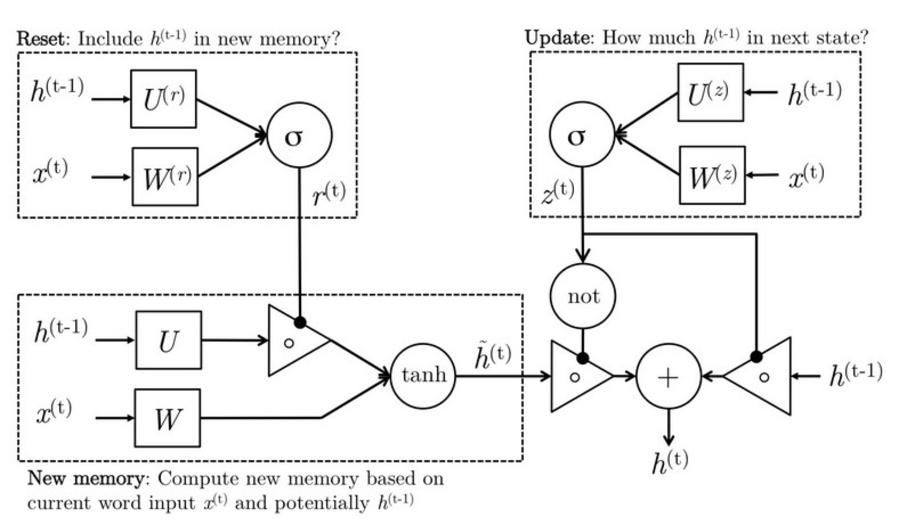  


### 3.实验结果
本次实验是帮师兄做了的一个关于设备识别分类的工作。从50W条设备banner信息中对设备品牌和型号进行识别。  
因为数据相对规整，用lstm处理得到的效果也非常好，正确率能达到99%  
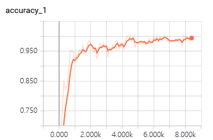

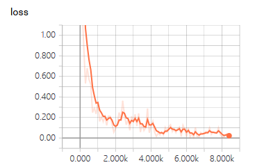

### 4.LSTM和GRU的区别
先给出一些结论：  
- GRU和LSTM的性能在很多任务上不分伯仲。
- GRU 参数更少因此更容易收敛，但是数据集很大的情况下，LSTM表达性能更好。
- 从结构上来说，GRU只有两个门（update和reset），LSTM有三个门（forget，input，output），GRU直接将hidden state 传给下一个单元，而LSTM则用memory cell 把hidden state 包装起来。


## <span id="HAN">HAN</span>
### 1.模型介绍
#### 1.1 特点  
（1）可以直观的看出用这个模型构建文本表示时各个句子和单词的重要程度，增强了可解释性。  
（2）文本中不同句子对文本的主旨影响程度不同，一个句子中不同的词语对句子主旨的影响程度也不同，因此HAN在**词语层面**和**句子层面**分别添加了注意力机制。

#### 1.2 结构
它包括四个部分：一个词序列编码器，一个词级注意层，一个句子编码器和一个句子层注意层。具体结构如下图所示：  
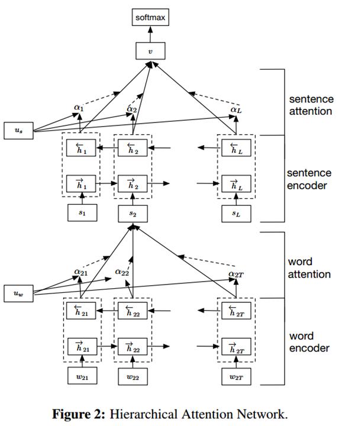  
---
（1）词序列编码器是通过一个双向GRU实现的  
  
其中：  
 $w_{it}: 第i个句子的第t个词语$     
 $W_e$  : embedding_matrix  
前向和后向结果拼接得到词序列编码：  
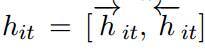  

（2）词级Attention层
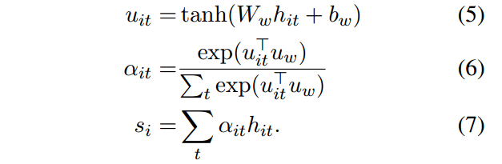  
其中 $6$ 式得到权重向量

(3)句子编码器和词编码器类似  
  
拼接后得到句子编码结果  
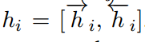  

（4）句子级Attention层  
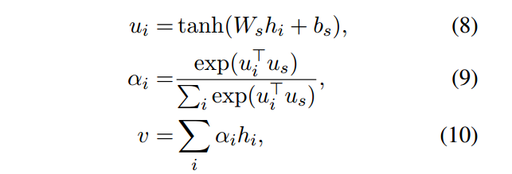  
得到 $v$ 即为文档的向量表示，可以通过一个全连接层,然后softmax输出，进行文档分类。  
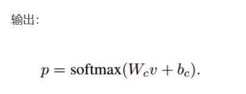  

#### 1.3 可视化  
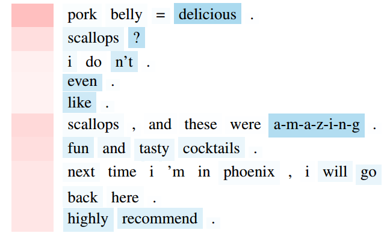  
图中蓝色颜色深浅表示word level的attention权重，红色颜色深浅表示sentence level的attention权重。


## <span id="glove">Glove</span>
